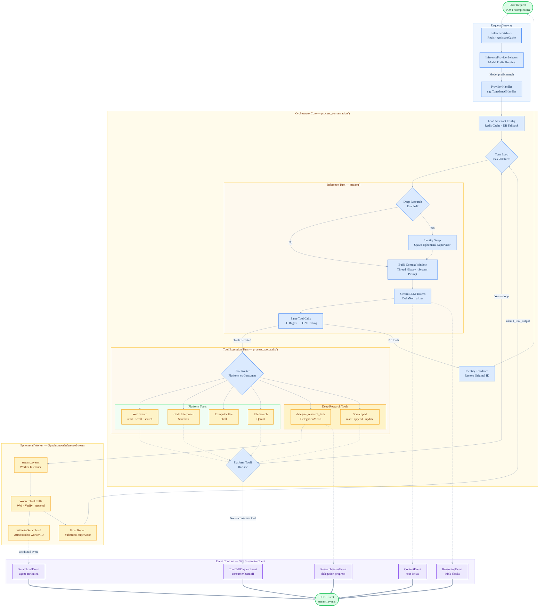

# .github
Public README
# Project David

> David was the first entity. What began as a single GPT with a custom system prompt grew into a full AI orchestration platform.

Project David is an open source AI orchestration substrate — a platform for building, running, and coordinating intelligent agents at scale.

Built for engineers who won't trade data sovereignty for convenience.
Run open-weight models. Own your infrastructure. Orchestrate at scale.

## Ecosystem

| Repo | Description |
|---|---|
| [platform](https://github.com/project-david-ai/platform) | Core orchestration engine — supervisors, workers, streaming infrastructure |
| [projectdavid](https://github.com/project-david-ai/projectdavid) | Python SDK |
| [entities-common](https://github.com/project-david-ai/entities-common) | Shared utilities and validation |
| [david-core](https://github.com/project-david-ai/david-core) | Docker orchestration layer |
| [reference-backend](https://github.com/project-david-ai/reference-backend) | Flask reference implementation |
| [reference-frontend](https://github.com/project-david-ai/reference-frontend) | React reference implementation |

## Architecture

Project David is structured as a layered ecosystem. The **platform** is the core — a FastAPI orchestration engine that manages agents, tools, threads, and state. The **SDK** gives developers a clean Python interface to the platform without needing to interact with the REST API directly. **david-core** handles cloud deployment, TLS, and routing for the hosted instance.

The orchestration layer supports multi-agent deep research out of the box — a supervisor agent plans and delegates, workers execute in parallel, and a shared scratchpad provides observable, attributed state across the entire run.

### Ecosystem Map

```mermaid
%%{init: {
  "theme": "base",
  "themeVariables": {
    "background": "#f8f9fc",
    "primaryColor": "#dbeafe",
    "primaryTextColor": "#1e3a5f",
    "primaryBorderColor": "#3b82f6",
    "secondaryColor": "#fef3c7",
    "secondaryTextColor": "#78350f",
    "secondaryBorderColor": "#f59e0b",
    "tertiaryColor": "#ede9fe",
    "tertiaryTextColor": "#4c1d95",
    "tertiaryBorderColor": "#7c3aed",
    "nodeTextColor": "#1e293b",
    "edgeLabelBackground": "#f1f5f9",
    "clusterBkg": "#f8faff",
    "clusterBorder": "#cbd5e1",
    "titleColor": "#1e293b",
    "lineColor": "#94a3b8",
    "fontSize": "18px",
    "fontFamily": "Georgia, serif"
  }
}}%%
graph TD
    Developer([Your Application\nor Reference Implementation])

    subgraph DavidCore ["david-core — Cloud Orchestration Layer"]
        direction TB
        Proxy[nginx-proxy\nTLS Termination]
        ACME[acme-companion\nLet's Encrypt]
        Landing[open.projectdavid.co.uk\nLanding Page]
        Docs[docs.projectdavid.co.uk\nDocumentation]
    end

    subgraph SDK ["projectdavid — Python SDK"]
        direction TB
        EntityClient[Entity Client\nAssistants · Threads · Runs · Messages]
        SyncStream[SynchronousInferenceStream\nEvent Mapping · Tool Validation]
        Common[projectdavid_common\nValidation · Schemas · Utilities]
    end

    subgraph Platform ["platform — Core Orchestration Engine"]
        direction TB
        FastAPI[FastAPI\n80 Endpoints · /completions · SSE Streaming]

        subgraph Orchestration ["Orchestration Layer"]
            direction TB
            Supervisor[Supervisor Agent\nPlanning · Delegation]
            Worker[Research Worker\nWeb Search · Verification]
            Scratchpad[(Shared Scratchpad\nread · append · update)]
        end

        subgraph Tools ["Integrated Tools"]
            direction LR
            WebTools[Web Browsing\nread · scroll · search]
            CodeExec[Code Interpreter\nSandbox Execution]
            FileSearch[File Search\nVector Retrieval]
            Computer[Computer Use\nShell · Browser]
        end

        subgraph Storage ["Storage Layer"]
            direction LR
            MySQL[("MySQL\nPersistence")]
            Qdrant[("Qdrant\nVector Store")]
            Redis[("Redis\nStreaming · Cache")]
        end

        subgraph Observability ["Observability"]
            direction LR
            OTEL[OpenTelemetry\nCollector]
            Jaeger[Jaeger UI\nTrace Explorer]
        end
    end

    subgraph Consumers ["Reference Implementations"]
        direction LR
        RefFE[reference-frontend\nReact]
        RefBE[reference-backend\nFlask]
    end

    Developer --> |"pip install projectdavid"| EntityClient
    EntityClient --> Common
    EntityClient --> |"HTTPS / SSE"| FastAPI
    SyncStream --> |"stream_events"| FastAPI

    Proxy --> FastAPI
    ACME --> Proxy
    Proxy --> Landing
    Proxy --> Docs

    FastAPI --> Supervisor
    Supervisor --> |"delegates task"| Worker
    Supervisor --> Scratchpad
    Worker --> Scratchpad
    Worker --> WebTools
    Worker --> FileSearch
    Supervisor --> |"writes strategy"| Scratchpad

    FastAPI --> CodeExec
    FastAPI --> Computer
    FastAPI --> MySQL
    FastAPI --> Qdrant
    FastAPI --> Redis
    FastAPI --> OTEL
    OTEL --> Jaeger

    SDK --> RefBE
    RefBE --> RefFE

    classDef main fill:#dbeafe,stroke:#3b82f6,stroke-width:1.5px,color:#1e3a5f
    classDef worker fill:#fef3c7,stroke:#f59e0b,stroke-width:1.5px,color:#78350f
    classDef external fill:#dcfce7,stroke:#22c55e,stroke-width:1.5px,color:#14532d
    classDef bridge fill:#ede9fe,stroke:#7c3aed,stroke-width:1.5px,color:#4c1d95
    classDef storage fill:#f0fdf4,stroke:#86efac,stroke-width:1.5px,color:#14532d

    class FastAPI,Proxy,ACME main
    class Supervisor,Worker,Scratchpad worker
    class EntityClient,SyncStream,Common bridge
    class MySQL,Qdrant,Redis storage
    class WebTools,CodeExec,FileSearch,Computer external
    class Developer,RefFE,RefBE external

    style DavidCore fill:#eff6ff,stroke:#93c5fd,color:#1e3a5f
    style SDK fill:#f5f3ff,stroke:#a78bfa,color:#4c1d95
    style Platform fill:#fffbeb,stroke:#fcd34d,color:#78350f
    style Orchestration fill:#fef9ee,stroke:#fbbf24,color:#78350f
    style Tools fill:#fef9ee,stroke:#fbbf24,color:#78350f
    style Storage fill:#f0fdf4,stroke:#86efac,color:#14532d
    style Observability fill:#f0fdf4,stroke:#86efac,color:#14532d
    style Consumers fill:#eff6ff,stroke:#93c5fd,color:#1e3a5f
```



### Runtime Flow



## Documentation

Full documentation is available in the [docs](https://github.com/project-david-ai/docs) repository.

| Topic | Link |
|---|---|
| Platform Overview | [api-index.md](https://github.com/project-david-ai/projectdavid_docs/blob/master/src/pages/overview/api-index.md) |
| Quick Start | [sdk-quick-start.md](https://github.com/project-david-ai/projectdavid_docs/blob/master/src/pages/sdk/sdk-quick-start.md) |
| Assistants | [sdk-assistants.md](https://github.com/project-david-ai/projectdavid_docs/blob/master/src/pages/sdk/sdk-assistants.md) |
| Tools | [sdk-tools.md](https://github.com/project-david-ai/projectdavid_docs/blob/master/src/pages/sdk/sdk-tools.md) |
| Architecture | [sdk-architecture.md](https://github.com/project-david-ai/projectdavid_docs/tree/master/src/pages/architecture) |

> When the hosted docs site is live, all links above will be updated to `docs.projectdavid.co.uk`.

## Quick Start

Install the SDK:

```bash
pip install projectdavid
```

Run your first inference:

```python
from projectdavid import Entity

client = Entity(api_key="your_api_key")

assistant = client.assistants.create_assistant(
    name="my_assistant",
    instructions="You are a helpful AI assistant.",
)

thread = client.threads.create_thread()
```

See the [Quick Start guide](https://github.com/project-david-ai/projectdavid_docs/blob/master/src/pages/sdk/sdk-quick-start.md) for the full example.
